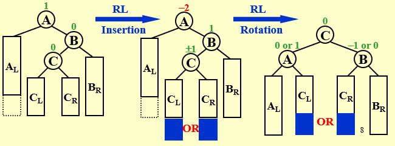

# ADS 1 

## AVL Trees

* Target: Speed up searching(with insertion and deletion)

* Tool: Binary search trees

  Average search time = $\frac{\sum{search time}}{N}$

* Definition: ...

  1>$T_L\; and\; T_R$ are height balanced, and;

  2>|$h_L-h_R$| <= 1;

  3>Balance Factor $BF(node) = h_L - h_R$ .It is -1,0,1 in an AVL tree.

* 4 rotation: RR, LL, LR, RL rotation (even don't need a pic)

  * single rotation RR: *Trouble Finder & child left rotation*
  
    
  
  * single rotation LL: *Trouble Finder & child right rotation*
  
    
  
  * double rotation LR: *lower left & upper right rotation*
  
    
  
  * double rotation RL: *lower right & upper left rotation*
  
    

> Subtree inheritance: The left and right subtrees of the lowest node are respectively assigned to the other two.

* Analysis:

  

## Splay Trees

* Target: Any M consecutive tree operations starting form an empty tree take at most $O(MlogN)$ time.(it means the $O(logN)$ is the amortized time)

* Solution: a  node *X*, the Parent *P*, the Grad parent *G*

  * case 1: *P* is the root -> Rotate *X & P*

  * case 2: *P* is not the root 

    *  Zig-zag:
    * Zig-zig:

  * >**Splaying not only moves the accessed node to the root, but also roughly halves the depth of most nodes on the path**.

* Deletion: 
  * Step 1: Find X;
  * Step 2: Remove X;
  * Step 3: FindMax($T_L$);
  * Step 4: Make $T_R$ the right child of the root of $T_L$;

## Amortized Analysis

* Target: Any M consecutive operations take at most $O(MlogN)$ time.

* 3 methods:

  * Aggregate analysis:

    Through an example *multipop* (it means pop k times)

    T = min(sizeof(S), k);

    sizeof(S)<=n   -> Push,Pop,MultiPop are both O(n)

    $T_amortized = O(n)/n = O(1)$

  * Accounting method:

    (When an operation's *amortized cost* $\hat{c_i}$ exceeds its *actual cost* $c_i$)

    credit -> the difference between the two;

    